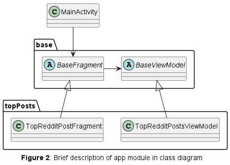
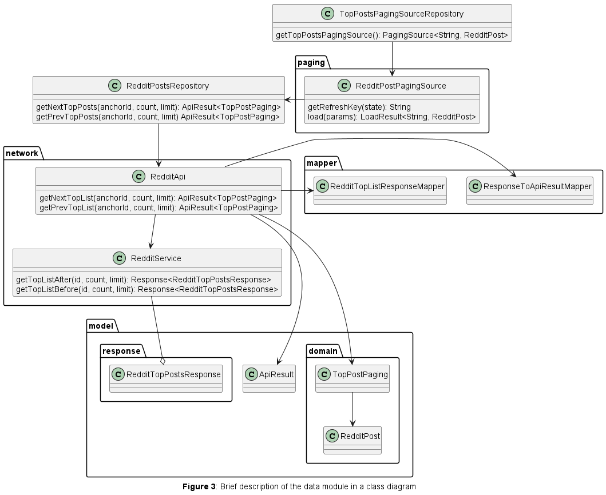

# ReadIt
Architectural demo app using the Reddit API to load the top reddits list.

The main goal of this implementation is to create an architectural base that serves as a starting point for any project.
This project aims to have a good architecture by applying coding patterns, industry best practices, and extensive use of advanced kotlin features to create straightforward code.

# Notes
I have uploaded the apk file and recorded a video for easy checking. Please check for the following files in the project's root folder if you wish:
- [app-prod-debug.apk](app-prod-debug.apk)
- [recorded-demo.mp4](recorded-demo.mp4)

# Features
- [x] List Top Reddits with thumbnails.
- [x] Pull to refresh Reddits.
- [x] Load more Reddits when reaching the end of the list.
- [x] Unit tests.

# Architectural proposal


The above diagram is a simplified overview of the current architecture.

This project owns 2 modules:
- The __app__ module contains the code for UI (fragments) and business logic (ViewModels).
- The __data__ module handles the data sources. The current implementation uses the repository pattern and fetches data directly from Reddit's API using a configured instance of Retrofit.

## Project dependencies
- Material design 2.
- Retrofit.
- Timber.
- Moshi converter.
- Hilt (DI).
- Jetpack/Paging.
- Glide.

## Testing dependencies
- JUnit 4.
- Mockito.
- Kotlin Coroutines Test.
- Google Truth assertions.

## Other features:
- ConstraintLayouts.
- Data-Binding.
- Binding adapters for showing the list images.
- Generic Error dialog base functionality.
- Use of Flows for UIEvents (check the BaseViewModel.uiEventFlow), and data flows between the UI and the ViewModels.
- wrapper function to handle async calls with user feedback from viewModels (check BaseViewModel.wrapWithLoadingAndErrorEvents)

# Components glue
The Hilt library is used for dependency injection. Both modules (app and data) contain a Module class for constructing the dependencies inside the di package name. Each module declares the necessary dependencies to resolve its dependency tree.

# App module description



The layout resource file that declares the UI for showing the reddits list uses data-binding to refresh the UI. The layout is linked directly to the ViewModel in this way:

```xml
    <data>
        <variable
            name="viewModel"
            type="com.victorvalencia.readdit.topPosts.TopRedditPostsViewModel" />
        <variable
            name="parentLifeCycleOwner"
            type="androidx.lifecycle.LifecycleOwner" />
    </data>
```

The BaseFragment class setups all this logic in a single place so that every fragment that extends from it doesn't need to declare boilerplate code by using inheritance reusability. With this, every new fragment is so simple and easy to maintain:

```kotlin
class MyNewFragment : BaseFragment<MyNewViewModel, NewFragmentBinding>() {

    override val fragmentViewModel: NewFragmentBinding by viewModels()
    override fun getLayoutResource() = R.layout.fragment_new_layout
    //...
}
```

The BaseViewModel is as well as practical. It provides basic functionality to let the devs reuse everyday UIEvent interactions, like showing spinner loaders or error dialogs that can be reused easily inside the view models.

The BaseViewModel also exposes a function, `wrapWithLoadingAndErrorEvents` to be used to execute and handle network error failures automatically by showing the indicated feedback to the user (showing a spinner loader and a generic error dialog):

```kotlin
// extracted from commit b17dbeeacf12ff0fef3b0303ae4cda48aca8bea4 in the project's git history (not currently used)
class TopRedditPostsViewModel @Inject constructor(
    private val redditRepository: RedditRepository
) : BaseViewModel() {

    val topRedditPosts: StateFlow<List<RedditPost>> = MutableStateFlow(emptyList())
    val testingText: StateFlow<String> = topRedditPosts.map { "Top posts received = ${it.size}" }
        .stateIn(viewModelScope, SharingStarted.Lazily, "Loading...")

    /**
        Fetch top reddits from repository, asyncronusly and showing errors for network failures
    **/
    fun getRedditPosts() {
        viewModelScope.launch {
            when (val result = wrapWithLoadingAndErrorEvents { redditRepository.getTopPosts() }) {
                is ApiResult.Success -> topRedditPosts.set(result.data)
                is ApiResult.Failure -> { Timber.e("Error was received while trying to fetch the Reddit Tops: $result") }
            }
        }
    }

}
```

# Data module description



This module is responsible for managing data sources.
Right now, the project only supports network data sources with Retrofit. Still, using the Repository pattern has been designed to be highly interchangeable for any data source type.

The current implementation uses the `TopPostsPagingSourceRepository` to obtain a `RedditPostPagingSource` for the JetPack/Paging View. This _PagingSource_ reuses the `RedditPostsRepository` to access the RedditApi.
The `RedditPostsRepository` class uses a couple of mappers to convert the raw response received from the `RedditService` into a domain model object.
This cascade dependency hierarchy is highly decoupled thanks to interfaces (IoC pattern and DI principle), which give us a decoupled code that is highly testable and maintainable.

## Data Mappers
Mappers are as well an essential part of the architecture's building blocks. In __Figure 3__, you can see we have two mappers:
- __ResponseToApiResultMapper__: converts a Retrofit response object into an `ApiResult` object. The `ApiResult` objects provide useful extension functions and sealed classes to access the data under the hood or handling network failures without crashing the app with an ANR event.
- __RedditTopListResponseMapper__: is a specific domain model converter used to access the top reddits list returned by the API.

# TO-DO for extra features ideas:
- [ ] Support for different device resolutions and orientation.
- [ ] Display Reddit details (only for Reddits with images in PNG and JPG format).
- [ ] Save Reddit image into photo library.
- [ ] Offline mode: Using a simple storage mechanism based on HTTP cache headers with okHttp or an sqlite database manager like room.
- [ ] Transitions.